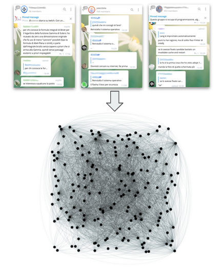

# Sockpuppet Detection: a Telegram case study 
[[Conference video]](https://www.youtube.com/watch?v=2fNYiQUoXIc) | [[Book of Abstract]](https://zenodo.org/record/4741056)
| [[Best Presentation Award]](https://2020.complexnetworks.org/awards/)


Repository related to our extended abstract paper "Sockpuppet Detection: a Telegram case study" 
presented at COMPLEX NETWORKS 2020 conference, thanks to which we won the best presentation award.




It contains, up to now, the script that let you scrape multiple telegram groups and create a network from it. 

## Citation ##
If this work (or any code present) is helpful, please cite as:
```
@inproceedings{telegramsockpuppet2020,
  title="Sockpuppet Detection: a Telegram Case Study",
  author="Gabriele Pisciotta, Miriana Somenzi, Elisa Barisani, Giulio Rossetti",
  booktitle="The 9th International Conference on Complex Networks and Their Applications - Book of Abstracts.",
  doi="10.5281/zenodo.4741056",
  pages="322--324",
  year="2020"
}
```

## Contacts
|Project member |e-mail address |
|---|---|
| [Gabriele Pisciotta](https://github.com/GabrielePisciotta)  | ga.pisciotta@gmail.com |
| [Miriana Somenzi](https://github.com/mirianasomenzi) | m.somenzi@studenti.unipi.it |
| Elisa Barisani | e.barisani@studenti.unipi.it |
| [Giulio Rossetti](https://github.com/GiulioRossetti) | giulio.rossetti@isti.cnr.it |
